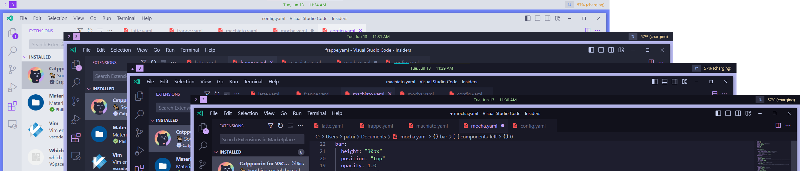

<h3 align="center">
	 
	
	Catppuccin for <a href="https://github.com/lars-berger/GlazeWM">GlazeWM</a>
	
</h3>

	
	
	

	

## Previews

🌻 Latte

🪴 Frappé

🌺 Macchiato

🌿 Mocha

## Usage

1. Copy [Catppuccin YAML][catppuccin-yaml] into [GlazeWM config][glazewm-config].
2. Use Catppuccin YAML aliases `*ctp-<flavor>-<color>` e.g. `*ctp-mocha-base`.
3. Save config file and reload GlazeWM.
4. Import [Catppuccin CSS][catppuccin-css] into [Zebar config][zebar-config].
5. Use Catppuccin CSS variables `var(--ctp-<flavor>-<color>)` (e.g. `var(--ctp-mocha-mauve)`).
6. Save config file and reload Zebar.

> Check out the example [GlazeWM config][glazewm-example] or [Zebar config][zebar-example] to get started quickly!

## 🙋 FAQ

Q: Where are the YAML anchors and aliases defined?  
A: See [Catppuccin YAML][catppuccin-yaml].

Q: Where are the CSS variables defined?  
A: See [Catppuccin CSS][catppuccin-css].

## 💝 Thanks to

- [fathulfahmy](https://github.com/fathulfahmy)

&nbsp;

	

	Copyright &copy; 2021-present <a href="https://github.com/catppuccin" target="_blank">Catppuccin Org</a>

	

[catppuccin-yaml]: https://github.com/catppuccin/glazewm/blob/main/themes/catppuccin.yaml
[catppuccin-css]: https://github.com/catppuccin/palette/blob/main/docs/css.md
[glazewm-config]: https://github.com/glzr-io/glazewm#config-documentation
[glazewm-example]: examples/glazewm.yaml
[zebar-config]: https://github.com/glzr-io/zebar#-getting-started
[zebar-example]: examples/zebar.css
